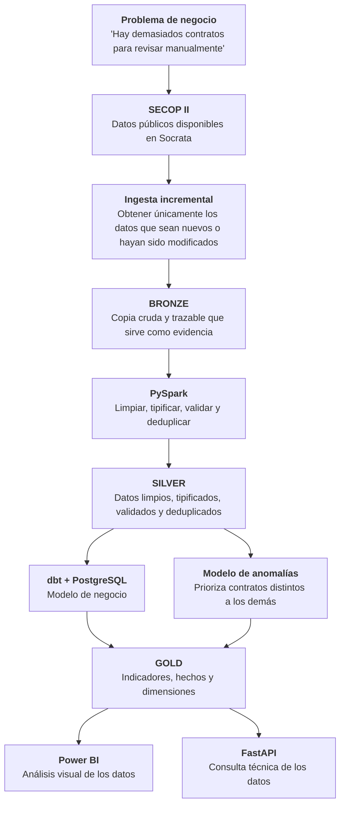

# Observatorio SECOP

El Observatorio SECOP busca convertir datos públicos de contratación en información comprensible para analizar cómo se distribuyen los recursos públicos en Antioquia y orientar revisiones humanas hacia los casos que merecen mayor atención.

## El problema

La información contractual está disponible, pero su volumen, variabilidad y dispersión dificultan responder preguntas básicas de manera consistente: cuánto se contrata, con quién, bajo qué modalidades, cómo cambia el comportamiento en el tiempo y dónde aparecen patrones atípicos.

Esa dificultad limita el seguimiento ciudadano y obliga a invertir demasiado tiempo en reunir, limpiar y reconciliar datos antes de poder analizarlos.

El flujo de datos planteado es el siguiente: 

## La solución

El proyecto construye una ruta reproducible que transforma datos de SECOP II en:

- información contractual depurada y trazable;
- indicadores comparables sobre valor, volumen, oportunidad y concentración;
- vistas para explorar entidades, proveedores, modalidades, territorios y periodos;
- señales explicables que ayuden a priorizar contratos para revisión humana;
- medios de consulta mediante productos analíticos y una API documentada.

La priorización es una ayuda para ordenar la revisión. Una señal alta NO demuestra fraude, corrupción, incumplimiento ni responsabilidad legal.

## Alcance actual

El repositorio cuenta con una base local reproducible, ingesta Bronze incremental, una capa Silver tipificada y un modelo estrella de contratos construido con dbt sobre PostgreSQL. Los indicadores, la priorización, API, dashboard y publicación en nube se incorporan de manera incremental y pueden seguirse en el [tablero del proyecto](https://github.com/users/camiloandcu/projects/1).

## Principios

- Trazabilidad desde el dato publicado hasta el resultado presentado.
- Criterios y fórmulas explícitos, reproducibles y verificables.
- Separación clara entre hechos observados, indicadores y señales de priorización.
- Uso responsable: las anomalías orientan preguntas, no producen acusaciones.
- Protección de secretos, datos innecesarios y artefactos internos.
- Costos y límites operativos visibles.

## Documentación

La [página de documentación](docs/README.md) organiza las guías según la necesidad:

- [Primeros pasos](docs/getting-started.md) para preparar y levantar el entorno local.
- [Guía de desarrollo](docs/development.md) para calidad, CI y estructura del repositorio.
- [Guía de operación](docs/operations.md) para salud, logs, recuperación y limpieza.
- [Transformación y calidad Silver](docs/silver-quality.md) para el esquema, reglas, rechazos y publicación local.
- [Modelo estrella con dbt](docs/star-schema.md) para la carga relacional, dimensiones, hecho, pruebas y catálogo.

Las historias y su avance se consultan en [GitHub Issues](https://github.com/camiloandcu/observatorio-secop/issues) y en el [tablero del proyecto](https://github.com/users/camiloandcu/projects/1).
