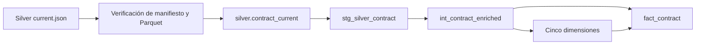

# Modelo estrella de contratos

## Propósito y límites

El modelo estrella ofrece una vista estable y trazable de los contratos vigentes en Silver. PostgreSQL mantiene el snapshot relacional y dbt construye una tabla de hechos y cinco dimensiones para consultas consistentes.

Esta capa no calcula indicadores, agregaciones Gold, puntuaciones ni lógica para Power BI. Tampoco consulta Socrata o Bronze: su único límite de entrada es una versión Silver publicada y verificada.

## Flujo



`secop-warehouse` acepta únicamente el bundle señalado por `data/silver/current.json`. Antes de conectarse a PostgreSQL comprueba:

- que el puntero resuelva exactamente `versions/<silver_version_id>/manifest.json`;
- hash del manifiesto, estado `valid` y ausencia de controles críticos fallidos;
- existencia, tamaño y SHA-256 de cada archivo inventariado;
- esquema y tipos exactos del Parquet;
- conteo declarado, una fila por `contract_key` e identificadores obligatorios.

Una falla termina antes de modificar la base.

## Configuración local

Instala el entorno y prepara un perfil dbt local:

```bash
make install
cp .env.example .env                 # solo la primera vez; ajusta valores locales
mkdir -p .dbt
cp dbt/profiles.yml.example .dbt/profiles.yml
```

El perfil usa `POSTGRES_HOST`, `POSTGRES_PORT`, `POSTGRES_DB`, `POSTGRES_USER`, `POSTGRES_PASSWORD`, `DBT_SCHEMA` y `DBT_THREADS`. `POSTGRES_HOST` es opcional y toma `127.0.0.1`. El cargador también usa `SILVER_ROOT`. `.env`, `.dbt/`, `dbt/target/` y `dbt/logs/` están ignorados.

Exporta el archivo solo en la shell que ejecutará el cargador y dbt:

```bash
set -a
source .env
set +a
```

No copies credenciales en `profiles.yml.example`, comandos, issues o logs.

## Carga Silver → PostgreSQL

Inicia PostgreSQL, verifica Silver y carga:

```bash
make up
uv run --locked --extra warehouse secop-warehouse verify
make load-warehouse
```

La carga adquiere un advisory lock y crea una tabla temporal dentro de la transacción. Después:

1. valida filas y llaves en staging;
2. inserta o actualiza por `contract_key` cuando cambia versión o payload;
3. elimina llaves ausentes del snapshot Silver autoritativo;
4. registra versión, hash y conteos en `silver.load_audit`;
5. confirma todos los cambios juntos.

Repetir la misma versión y hash es un no-op exitoso. Reutilizar una `silver_version_id` con otro hash falla como conflicto. Una excepción revierte staging, upsert, retiros y auditoría.

Los logs contienen versión, estado y conteos, nunca contraseña ni DSN completo.

## Granularidad e identidad

`fact_contract` tiene una fila por `contract_key`: el contrato vigente que Silver seleccionó de forma determinística. Una corrección histórica actualiza esa fila; este modelo no conserva SCD2.

Las llaves sustitutas de texto se calculan con el `md5` nativo de PostgreSQL sobre `star_key_v1|<namespace>|<natural_key>`. El hash aporta estabilidad y portabilidad, no seguridad. Tests comprueban unicidad y correspondencia entre llave natural y sustituta.

| Modelo | Llave natural | Llave sustituta | Política desconocida |
|---|---|---|---|
| `fact_contract` | `contract_key` | `contract_sk` | No aplica |
| `dim_entity` | dataset + nombre normalizado | `entity_sk` | `__UNKNOWN__` si falta nombre |
| `dim_supplier` | no disponible en Silver | `supplier_sk` | único miembro `__UNKNOWN__` |
| `dim_municipality` | `municipality_key` | `municipality_sk` | `__UNKNOWN__` si Silver marca UNKNOWN |
| `dim_modality` | modalidad normalizada | `modality_sk` | `__UNKNOWN__` si falta modalidad |
| `dim_date` | fecha calendario | entero `YYYYMMDD` | `date_sk=0` |

Silver no expone identificador ni nombre de proveedor. Por eso `dim_supplier` contiene solo el miembro desconocido y todos los hechos lo referencian. El modelo no infiere proveedores ni lee Bronze lateralmente. La entidad tampoco tiene código fuente en Silver; su identidad por dataset y nombre normalizado es provisional y los tests bloquean colisiones observadas.

## Trazabilidad

`fact_contract` conserva:

- `contract_key`, `contract_id` y `process_id`;
- `source_url`, `source_updated_at` y `bronze_fetched_at_utc`;
- `silver_version_id`, `silver_manifest_sha256` y `payload_sha256`;
- `loaded_at`, tomado de `finished_at_utc` del manifiesto Silver;
- fechas de firma, inicio y terminación junto con sus claves;
- valor contractual, duración y estado fuente.

`loaded_at` no usa la hora de ejecución de dbt. Reconstruir la misma versión conserva el mismo valor lógico.

## Construcción incremental y rebuild

Ejecuta el modelo y todos sus tests:

```bash
make dbt-parse
make dbt-build
make dbt-test
```

Los modelos publicados usan materialización incremental y llaves únicas. Como Silver es un snapshot autoritativo, cada modelo reconcilia su contenido en una transacción antes de insertar la proyección vigente. Esto retira hechos y miembros obsoletos y evita que una carga incremental acumule residuos.

Para reconstruir desde cero:

```bash
make dbt-build DBT_ARGS=--full-refresh
```

Para una misma `silver.contract_current`, incremental y full refresh deben coincidir en columnas, filas, llaves, conteos y hashes canónicos. La suite de integración compara ambos resultados.

## Controles dbt

`dbt build` bloquea el resultado cuando encuentra:

- llaves naturales o sustitutas nulas o duplicadas;
- un contrato repetido o distinto del conjunto fuente;
- relaciones inválidas entre hecho y dimensiones;
- estados distintos de `KNOWN` y `UNKNOWN` en dominios controlados;
- cero o más de un miembro desconocido;
- colisiones entre llaves naturales y sustitutas;
- diferencias de trazabilidad entre Silver y el hecho.

Una ausencia explícita usa el miembro desconocido. Una llave presente que no resuelve no se convierte silenciosamente en desconocida: el test de relación falla.

## Catálogo dbt

Genera y sirve la documentación local:

```bash
make dbt-docs
uv run --locked --extra warehouse dbt docs serve \
  --project-dir dbt --profiles-dir .dbt --host 127.0.0.1 --port 8081
```

`dbt/target/` contiene el catálogo generado y permanece fuera de Git. Cada source, modelo y columna declara descripción, identidad, nulidad y procedencia.

## Diagnóstico y recuperación

### Silver no verifica

Ejecuta `secop-silver inspect` y revisa el manifiesto publicado. No edites un bundle inmutable. Corrige la causa en Bronze/Silver o vuelve mediante el comando soportado a una versión Silver válida.

### La carga PostgreSQL falla

La transacción conserva el snapshot anterior. Corrige conexión, espacio o conflicto y repite `make load-warehouse`; no limpies tablas manualmente.

### Un test dbt falla

El mensaje identifica modelo, columna o relación. Las tablas siguen consultables para diagnóstico, pero el build no es válido. Corrige la fuente o modelo y repite `make dbt-build`. Usa `--full-refresh` si cambió el esquema físico.

### Volver a una versión Silver anterior

```bash
uv run --locked --extra data secop-silver rollback --version <silver_version_id>
make load-warehouse
make dbt-build
```

El bundle anterior debe seguir siendo válido. La reconciliación restaurará contratos y dimensiones correspondientes sin borrar evidencia Silver.
